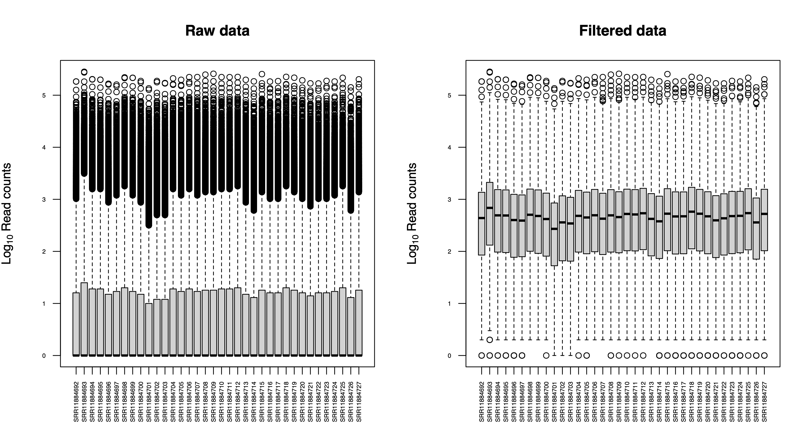
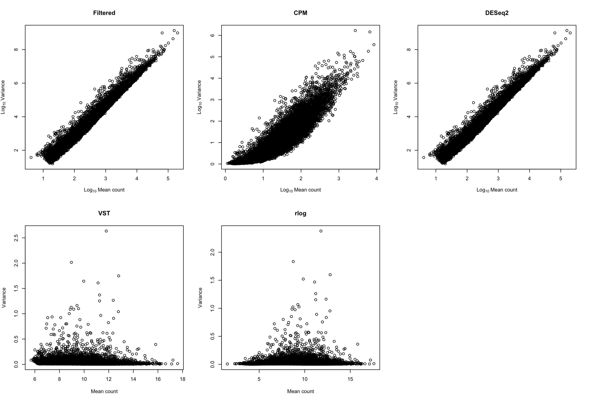
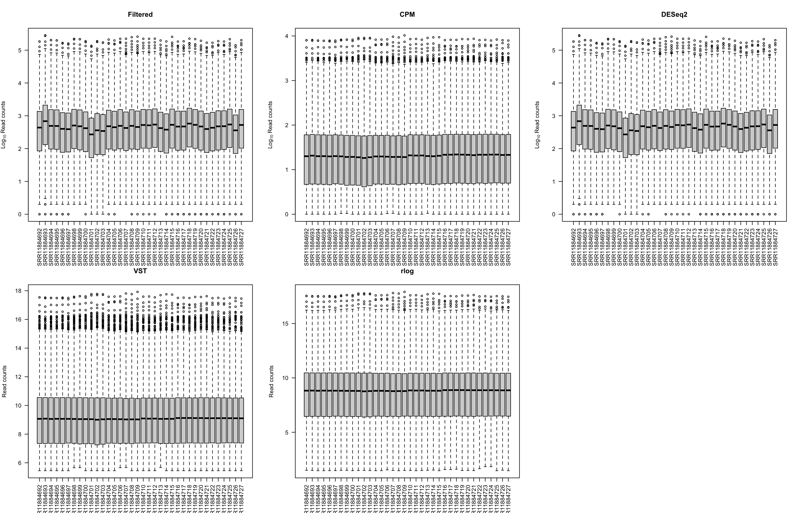
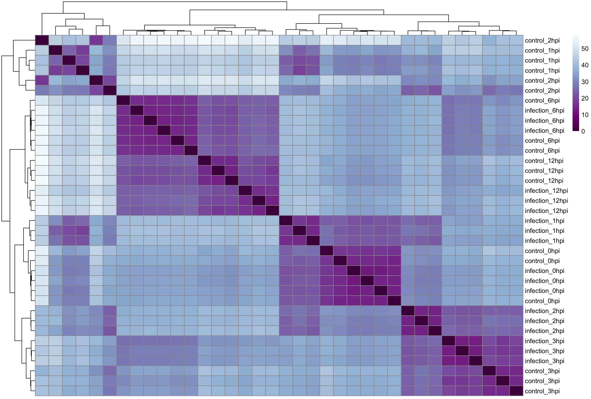
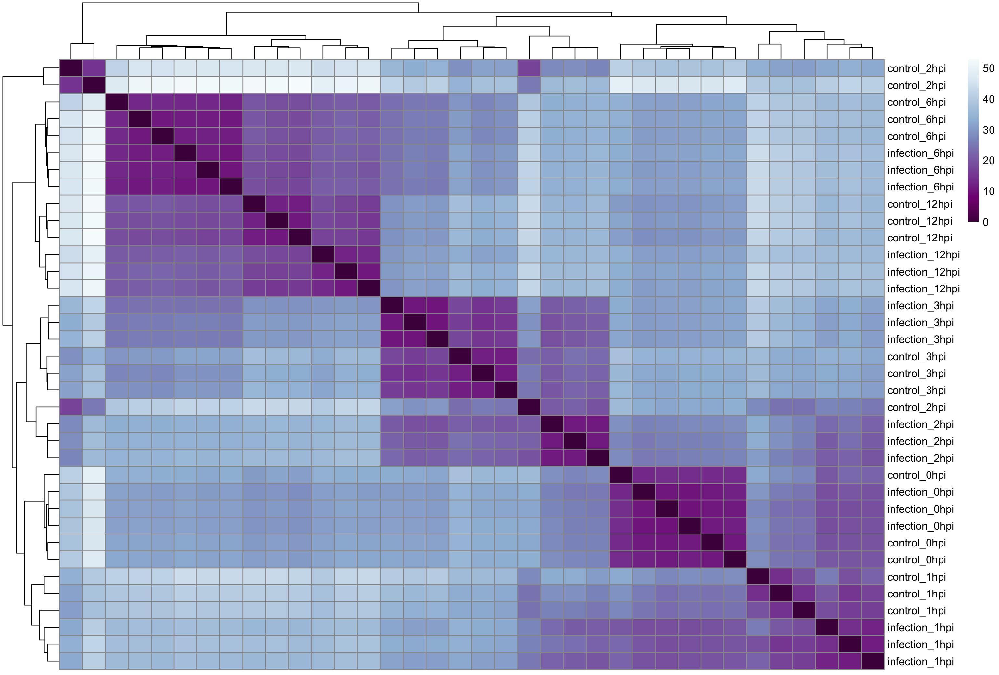
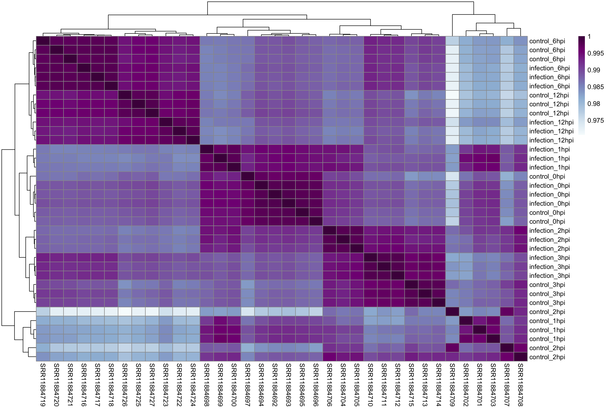
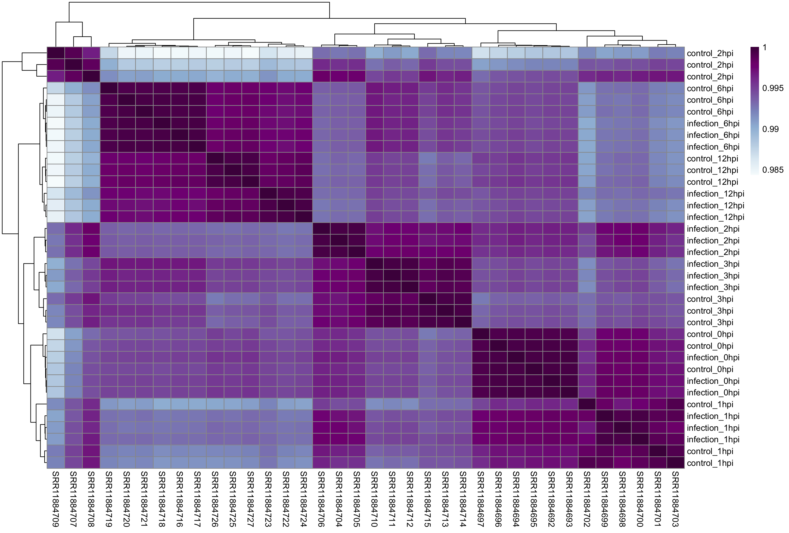
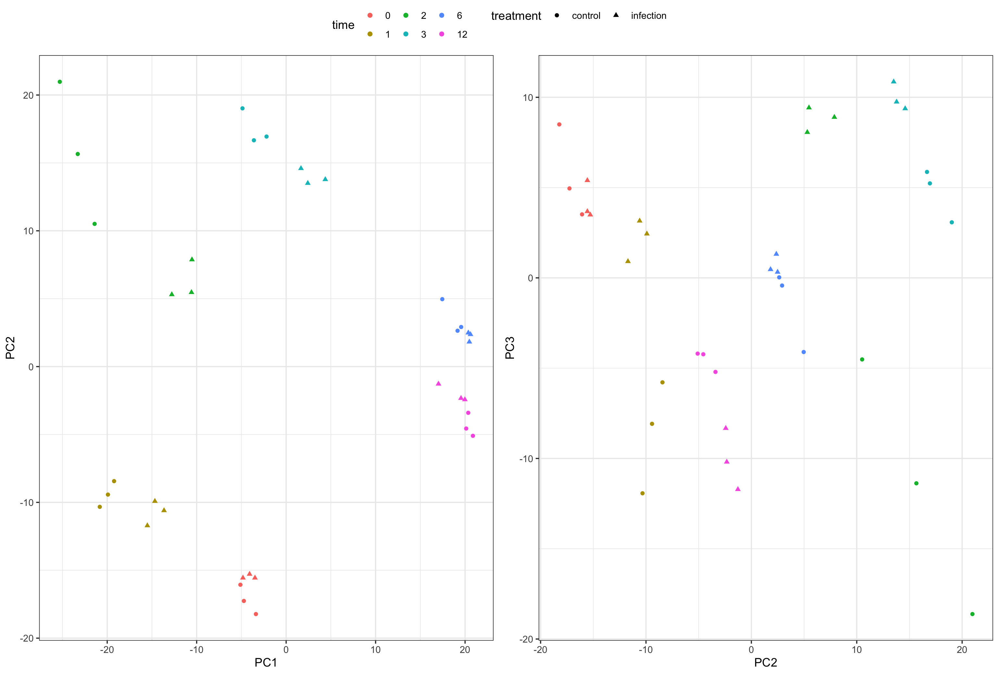
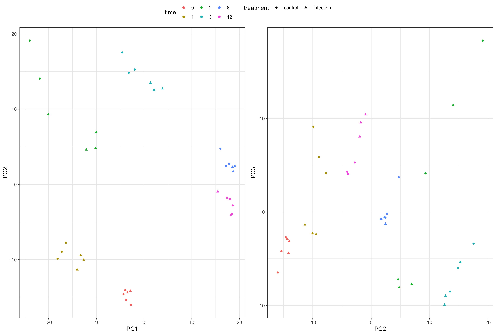
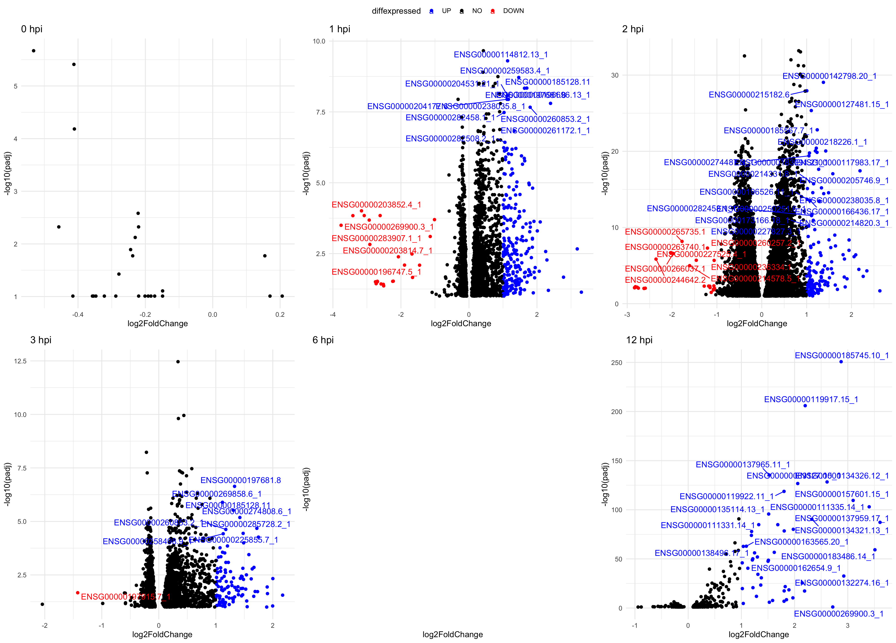

# PRJNA636173 {#PRJNA636173}

- **Title:** Experimental and natural evidence of **SARS-CoV-2** infection-induced activation of type I interferon responses (**human**)

- **Paper:** [@Banerjee2021]

- **NCBI project link:** <https://www.ncbi.nlm.nih.gov/bioproject/PRJNA636173> 

- **Overall design:** We infected triplicated human lung epithelial cells (Calu-3) at a multiplicity of infection (MOI) for SARS-CoV-2 of 2, with comparison to triplicated uninfected controls. One hour post infection, the inoculum was removed and the clock was set to zero. We extracted and sequenced poly-A enriched RNA at 0, 1, 2, 3, 6 and 12 hours post infection (hpi) using an Illumina HiSeq 2500 with 2 x 50 bp chemistry to a minimum of 21.9 million clusters per replicate. Paired-end sequencing reads were mapped to the human reference transcriptome (GRCh37.67)

## Some experiment info
### Time series aspects

- Host type: human lung epithelial cells (Calu-3)     
- Sample points:  0, 1, 2, 3, 6 and 12 hours post infection (hpi)    
- Groups: infected & uninfected     
- Biological replicates: 3    
- Total samples: 36    

### RNA sequencing considerations

- Sequence mean length: 50 bp      
- Illumina HiSeq 2500      
- Paired-end      

### Samples

Samples analyzed:

SRR11884692
SRR11884693
SRR11884694
SRR11884695
SRR11884696
SRR11884697
SRR11884698
SRR11884699
SRR11884700
SRR11884701
SRR11884702
SRR11884703
SRR11884704
SRR11884705
SRR11884706
SRR11884707
SRR11884708
SRR11884709
SRR11884710
SRR11884711
SRR11884712
SRR11884713
SRR11884714
SRR11884715
SRR11884716
SRR11884717
SRR11884718
SRR11884719
SRR11884720
SRR11884721
SRR11884723
SRR11884724
SRR11884725
SRR11884726
SRR11884727

## Preprocesing considerations

- Host: Human 

   - Reference used: hg19 (GRCh37) genome assembly

`wget https://ftp.ebi.ac.uk/pub/databases/gencode/Gencode_human/release_39/GRCh37_mapping/GRCh37.primary_assembly.genome.fa.gz`

`wget https://ftp.ebi.ac.uk/pub/databases/gencode/Gencode_human/release_39/GRCh37_mapping/gencode.v39lift37.annotation.gtf.gz` 

### Cleaning process

Ran in SLURM. The `minlength` set for this experiment was 40. 

`sbatch clean_wbbduk.sh SRR_listAcc_PRJNA636173.txt`

```{bash, eval=F}
#!/bin/bash
#clean_wbbduk.sh
#SBATCH --job-name=clean 
#SBATCH --partition=short
#SBATCH --ntasks=1 
#SBATCH --cpus-per-task=32 
#SBATCH --mem=30gb 
#SBATCH --time=1-00:00:00 
#SBATCH --output=clean_%j.log 

<< "clean_wbbduk.sh"
For each sample in fq_dir:
- Clean the fq.gz with bbduck.sh

MJ
2022/02/21
clean_wbbduk.sh

# paths
samples=$1
adapters="/storage/evsysvir/TimeSeries/references/adapters.fa"
fq_dir="/storage/evsysvir/TimeSeries/PRJNA636173/raw_data"
clean_dir="/storage/evsysvir/TimeSeries/PRJNA636173/clean_data"
qc2_dir="/storage/evsysvir/TimeSeries/PRJNA636173/QC2"

minlength=40

while read sample
do
        echo "****************** PROCESSING $sample ******************"
        bbduk.sh \
        in1=${fq_dir}/${sample}_1.fastq \
        in2=${fq_dir}/${sample}_2.fastq \
        out1=${clean_dir}/${sample}_clean_1.fq.gz \
        out2=${clean_dir}/${sample}_clean_2.fq.gz \
        ref=${adapters} \
        ktrim=r k=21 mink=11 \
        qtrim=r trimq=10 maq=5 minlength=$minlength

done < $samples
```

## Alignment vs complete genome with STAR

We are going to align versus the **complete genome**, not the transcriptome (option used in the original paper). The reason is that we want to do allways the same process and for _A. thaliana_ there are not a good transcriptome available (for _C. elegans_ I don't know yet).

- Building index (careful with this!):     

_Interactively_ in garnatxa (The process is high memory consuming and in that way can't finish the process)

```{bash, eval=F}
path\to\STAR --runThreadN 6 \
--runMode genomeGenerate \
--genomeDir genome_hg19_index \
--genomeFastaFiles /storage/evsysvir/TimeSeries/references/genome_hg19_index/GRCh37.primary_assembly.genome.fa \
--sjdbGTFfile /storage/evsysvir/TimeSeries/references/genome_hg19_index/gencode.v39lift37.annotation.gtf \
--sjdbOverhang 50 # readlength-1
```

Necessary to run in SLURM:

```{bash, eval=F}
#!/bin/bash
#generateIndex2STAR.sh
#SBATCH --job-name=generateIndex2STAR 
#SBATCH --partition=long
#SBATCH --ntasks=1 
#SBATCH --cpus-per-task=32 
#SBATCH --mem=200gb 
#SBATCH --time=1-00:00:00 
#SBATCH --output=generateIndex2STAR_%j.log 

<< "generateIndex2STAR"
In some cases (large genomes), we need a lot of memory to generate the index 
needed to align with STAR.

Use:
arg1 = path to genome.fasta
arg2 = path to genome.gtf
arg3 = max(readlength) - 1
arg4 = path to the output directory

generateIndex2STAR

genomeFasta=$1
genomeGTF=$2
length=$3
outDir=$4

STAR="/home/maolu/programs/STAR-2.7.9a/bin/Linux_x86_64/STAR"

$STAR --runThreadN 32 \
--runMode genomeGenerate \
--genomeDir $outDir \
--genomeFastaFiles $genomeFasta \
--sjdbGTFfile $genomeGTF \
--sjdbOverhang $length
```


- Alignment + markDuplicates + remove duplicates (keeping the dedup file too):

In _slurm_ as a batch

```{bash, eval=F}
#!/bin/bash
#map&dedup.sh
#SBATCH --job-name=map+dedup 
#SBATCH --partition=long
#SBATCH --ntasks=1 
#SBATCH --cpus-per-task=32 
#SBATCH --mem=100gb 
#SBATCH --time=10-00:00:00 
#SBATCH --output=map+dedup_%j.log 

<< "mapdedup"
For each sample in SRR_acc_list:
- Align paired end reads to the complete genome with STAR
- Mark duplicates with gatk4 (need to activate env)
- Generate a copy of bam files without duplicates

MJ
2022/02/21
mapdedup

samples=$1
dir_genome="/storage/evsysvir/TimeSeries/references/genome_hg19_index"
clean_dir="/storage/evsysvir/TimeSeries/PRJNA636173/clean_data"
dir_alignments="/storage/evsysvir/TimeSeries/PRJNA636173/alignments"
dir_dedup="${dir_alignments}/dedup"
dir_nodup="${dir_alignments}/nodup"
dir_dedup_metrics="${dir_alignments}/metrics"

gatk="/home/maolu/programs/gatk-4.2.2.0/gatk"
STAR="/home/maolu/programs/STAR-2.7.9a/bin/Linux_x86_64/STAR"

while read sample
do
    # Align vs complete genome hg19
    $STAR --runThreadN 12 \
    --genomeDir $dir_genome \
    --readFilesCommand gunzip -c\
    --readFilesIn ${clean_dir}/${sample}_clean_1.fq.gz ${clean_dir}/${sample}_clean_2.fq.gz \
    --outFileNamePrefix ${dir_alignments}/${sample}_ \
    --outSAMtype BAM SortedByCoordinate \
    --outSAMunmapped Within \
    --outSAMattributes NH HI NM MD AS

    # Mark duplicates
    $gatk MarkDuplicates \
    -I ${dir_alignments}/${sample}_Aligned.sortedByCoord.out.bam \
    -O ${dir_dedup}/${sample}_dedup.bam \
    -M ${dir_dedup_metrics}/${sample}_metrics.txt

    # Remove duplicates
    samtools view -hbF0x400 $dir_dedup/${sample}_dedup.bam > $dir_nodup/${sample}_nodup.bam

done < $samples

```

---

We performed the next steps in R

The project is named as 'prjna636173.Rproj'. In this project  

---


## From read counts matrix

### Exploration of samples

- Dimensions of raw counts matrix: 63357 x 36   

Filter genes conditions: ```rowSums(edgeR::cpm(cts)>1) >= 2```

- Dimensions of filtered raw counts: 16120 x 36



### Visualization of different transformations of the filtered raw counts

_Bottom methods (variance stabilizing method and regularized-logarithm transformation) are transformations for count data that stabilize the variance across the means. The transformed-data becomes approximately homoskedastic, and can be used directly for computing distances between samples and making PCA plots_




### Samples distances

We show redundant but maybe useful information to discuss which methods we prefer. 

#### Heatmap

- <b> DISTANCES </b>







- <b> CORRELATIONS </b> (_Spearman method_)





#### PCA of samples






## DEG analysis 

p.adj.cutoff = 0.05
lfoldchange.cutoff = 1

### WALD test

<b> Results </b>

__ Without been restrictive (alpha = 0.1, and no limit to the logfoldchange)_

```{r, }

```


<b> VOLCANO PLOTS </b>

Colored as DE genes if its padj < 0.05 and |log2FoldChange| >= 1.


 
### LRT test


