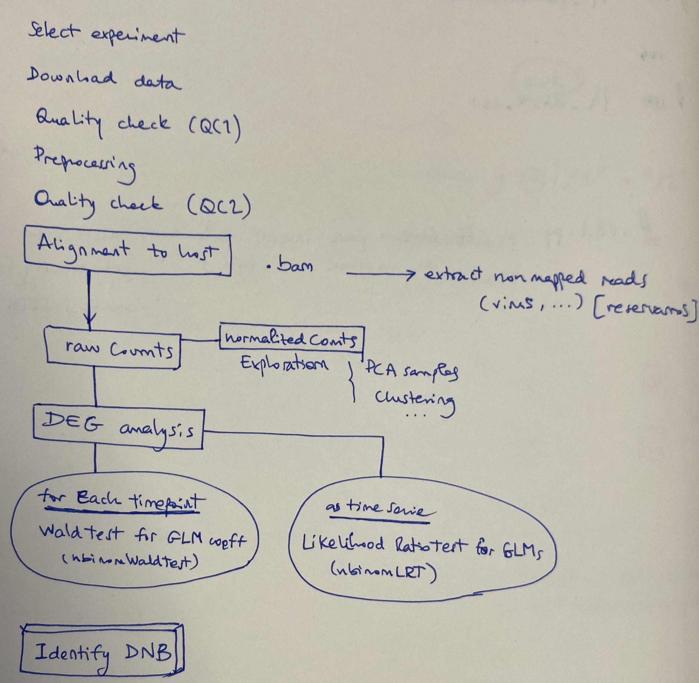

--- 
title: "Time Series Memories (always in construction)"
author: "María José Olmo Uceda"
date: "`r Sys.Date()`"
site: bookdown::bookdown_site
documentclass: book
bibliography: [book.bib, packages.bib]
# url: your book url like https://bookdown.org/yihui/bookdown
# cover-image: path to the social sharing image like images/cover.jpg
description: |
  Analysis of gene expression data in time series of viral infections. Tracking of the selected experiments and the processes followed from data download to DEG. One the differentialy expressed genes have been selected we will beging the study of those genes that can serve as early warnings. The first method we use use is based on Dynamical Network Biomarkers. 
  
link-citations: yes
github-repo: rstudio/bookdown-demo
---
 
# Introduction

Analysis of gene expression data in time series of viral infections. Tracking of the selected experiments and the processes followed from data download to DEG. 

One the differently expressed genes have been selected we will beging the study of those genes that can serve as early warnings. The first method we use use is based on **Dynamical Network Biomarkers**.

## General workflow

General information:

- From begining to matrix counts: [chapter 3](#previous-steps)     
- DEG analysis: [chapter 4](#deg-analysis)      

Each project analyzed will have its own chapter